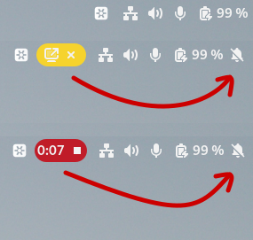
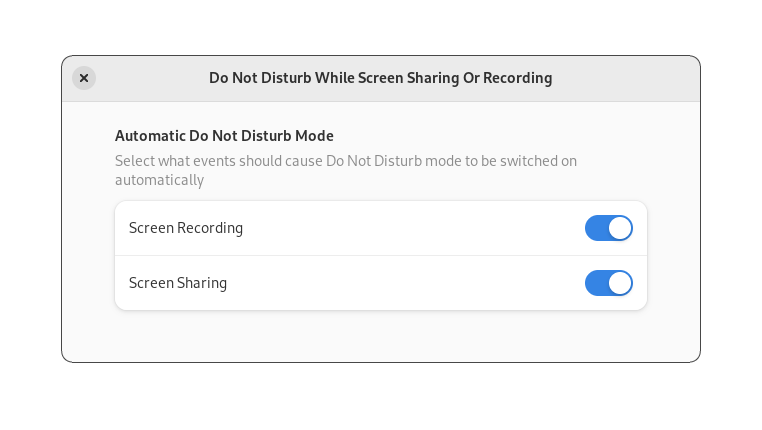

# Dim Completed Calendar Events Gnome Extension

A Gnome extension that styles calendar events in the top panel to
make it clear which events are completed, ongoing, and upcoming.

## Configuration

You are able to configure the following options:

