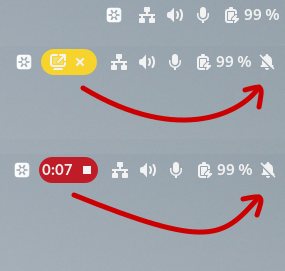
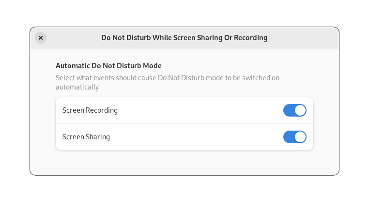

#  Do Not Disturb While Screen Sharing Or Recording Gnome Extension

<a
href="https://extensions.gnome.org/extension/5985/do-not-disturb-while-screen-sharing-or-recording/">
 </a>

Automatically switches on the "Do Not Disturb" mode while screen sharing,
screen recording, an application is in full screen, or a chosen application
(e.g. a game) is running. As soon as none of the enabled triggers are active
anymore, "Do Not Disturb" mode will be switched back off.

Do Not Disturb mode stops notifications from appearing on your screen to let you
focus on your work. Notifications may contain sensitive content that you might
not want to show to everyone while you're screen-sharing.

It is likely that not all screen recording apps will trigger the extension to do
its job. The extension was tested with the Gnome built-in screen recorder.



## Configuration

You are able to configure the following options:

- Screen Recording - enables Do Not Disturb while the screen is being recorded
- Screen Sharing - enables Do Not Disturb while the screen is being shared
- Full Screen Application - enables Do Not Disturb while any application is
  running in full screen
- Specific Applications - enables Do Not Disturb while any application from a
  user-defined list is running (e.g. games). Applications are matched by their
  `WM_CLASS`, which can be found by running `xprop WM_CLASS` in a terminal and
  then clicking on the application's window.
- Directories List - enables Do Not Disturb while any application running
  from within a user-defined list of directories (e.g. `~/Games/`) is
  running. This works by inspecting the process' executable path and command
  line arguments, so it also covers Wine/Proton games launched from within
  the directory. Detection for Wine/Proton games is best-effort, since how
  much of the original path is exposed varies between Wine/Proton versions.



## Contributing

In case of problems, it's a good idea to open an
[Issue](https://github.com/marcinjahn/gnome-do-not-disturb-while-screen-sharing-or-recording-extension/issues).
If you know how to fix it, open a [Pull
Request](https://github.com/marcinjahn/gnome-do-not-disturb-while-screen-sharing-or-recording-extension/pulls)!

### Local Development

To run the extension locally "from sources":

```
git clone git@github.com:marcinjahn/gnome-do-not-disturb-while-screen-sharing-or-recording-extension.git
cd gnome-do-not-disturb-while-screen-sharing-or-recording-extension
npm i
npm run build
npm run linkdist
```

The last command will creae a soft link at
`~/.local/share/gnome-shell/extensions/do-not-disturb-while-screen-sharing-or-recording@marcinjahn.com`,
which allows you to enable the extension on your system (e.g., via [Extensions
Manager](https://flathub.org/apps/com.mattjakeman.ExtensionManager)).

Anytime you change anything, rebuild the extension with `npm run build`, and
restart the session:

- on Wayland, log out and log in (I know, it's painful)
